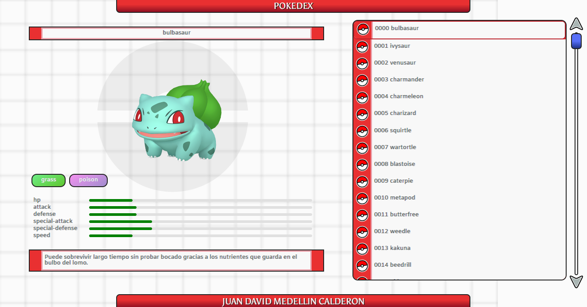

<h1>Pokedex</h1>

<a href="https://jdmcpokedex.surge.sh" target="_blank">
    
    
Pokedex

</a>

El programa se presenta como una aplicación web diseñada para servir como interfaz visual y consumir los datos del servidor PokéAPI. Este último es una enciclopedia digital que almacena información detallada sobre las diversas especies de criaturas ficticias conocidas como "Pokémon". La Pokedex permite a los usuarios adentrarse en el mundo de los Pokémon, explorando y aprendiendo sobre sus habilidades, evoluciones, tipos, estadísticas y otros datos esenciales de este universo de fantasía. El propósito fundamental de este proyecto radica en brindar una herramienta útil y divertida para los fanaticos de Pokémon.

